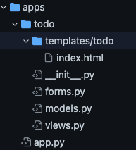

# Flaskアプリの作り方　ToDoアプリ編
忘備録としてざっくりまとめる!!!!

0. appの構成案を考える
   ToDoアプリなので、必要な要件は以下の通り。

   上から順番に実装していった。

- ToDoの入力ホーム(create)

- ToDoリストの一覧画面(read)

- 完了したToDoの削除機能(delete)

- 登録したToDoの編集機能(update)<-未実装

  

1. appを分割する粒度を決める
    今回はToDoアプリ自体を最小単位とする。

  

2. ディレクトリ構成を考える
    使用するappは一つだけなので、分割もくそもない。
    保守性を考えて機能分割する癖をつけたいので、以下のようなディレクトリ構成を考える

  

ToDoアプリをユーザー登録して使えるようにしたい！とかなったら、authorization appを追加し、
遷移する仕組みを作れば良い。
app単位で機能拡張していくイメージ。

3. app.pyにcreate_app関数を作る

  複数の子appを連携させ、親appを拡張していく（スケールする）場合、

  ホームディレクトリのapp.pyに共通処理を書くことで保守性を上げることができる。

  共通処理の例：

  1. 親app,子appのインスタンス化

  2. dbのインスタンス化とアプリとの紐付け

  最初に1.を以下の手順で行う

  - flask app のインスタンス化（親app）

  - 子appのviews.pyのimport

  - register_blueprintメソッドで、機能分割したappと子appを結びつける

  詳しくはp.86参照

  その後、.envファイルにcreate_appまでのpathを書いておく

4. (子app)/views.pyでBlueprintを使ってアプリをインスタンス化

   p.91参照

   

5. (子app)/views.pyにエンドポイントを書いてく
    一旦アプリのホームとなるエンドポイントができた時点で走らせてみて、エラーチェックするとよい、と思う。

  

  6. データベースのセットアップ

     todoを記録するためのデータベースのセットアップを行う。

     1. DB,migrateのインスタンス化

        以下二つのパッケージを使う

        - SQLAlchemy: python製O/Rマッパー。要はpythonのコードとSQLを変換してくれるもの。
        - flask-migrate:データベースをマイグレーションするflask拡張機能。
          migration=移民、移動     
          要は、DBの内容を保持したまま更新すること。

        SQLAlchemyはDBを読むためのパッケージ
         flask-migrateはDBを変更するためのflask拡張機能
        という認識。

        利用の流れはP97参照
        apps.appの中で、
        DB,Migrateをインスタンス化して、Appと連携したら良い

        

     2. モデル（データベースの構造）の定義
        難しく考えず、要は何の項目を、どのように、データとして保持するか。
        ここでは、シンプルにtodoの内容だけを保持する。
        todo/models.pyに書いていく。

     3. dbの初期化

        コマンドライン上でflask db init で初期化する。

7. フォームの作成(post)

   dbの用意は整ったので、あとは入力フォームを作る

   1. flask-wtfクラスのインスタンス化と、アプリとの紐付け 
      フォームを設ける以上、

      - 入力データのバリデーション

      - CSRF対策

        が必要になる。
        それをやってくれるのがflask-wtf。

        flaskが提供しているのは、webフレームワークとしての最小限の機能
        （ルーティング、テンプレート処理）
        よって、実装したい機能に応じて拡張機能を追加していく。
        ところで、wtfってなんの略なの、、、、

        flask-wtf利用の流れ はp113参照

   2. フォームクラスの作成
      クラスとして、別モジュールに書いていく
      p114参照
      これでフォーム画面が作成できた
      次に、同じ画面に追加したToDoのリストを表示するように改良していく。

      

8. ToDoリストの表示(read)
   まず、表示させたいエンドポイントはどこか,考える

   もちろんホームページ（エンドポイント名:index)

   表示するにはどうするか？以下の手順で行えば良い

   1. indexエンドポイントの中で、dbからtodoリストを全件取得する
   2. 取得したToDoリストをテンプレートに渡して表示する。

   ここらへんでデータベース操作のノウハウが必要になるんやなーと感じた。そんな難しいことではないと思うけど。

   

9. delete機能の実装(delete)
   ここでつまづいた
   要はボタンごとに異なる処理を実装したいのだが、方法がわからない。
   単純に、deleteのエンドポイントを作ってそこに遷移する仕組みをホームに作る
   その後、リダイレクトすればOK
   このサイトが参考になった
   https://myafu-python.com/work/todo/

10. update機能の実装(update)

    工事中。。。
